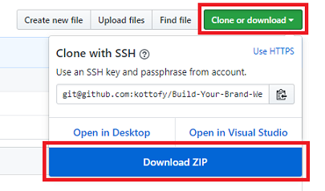
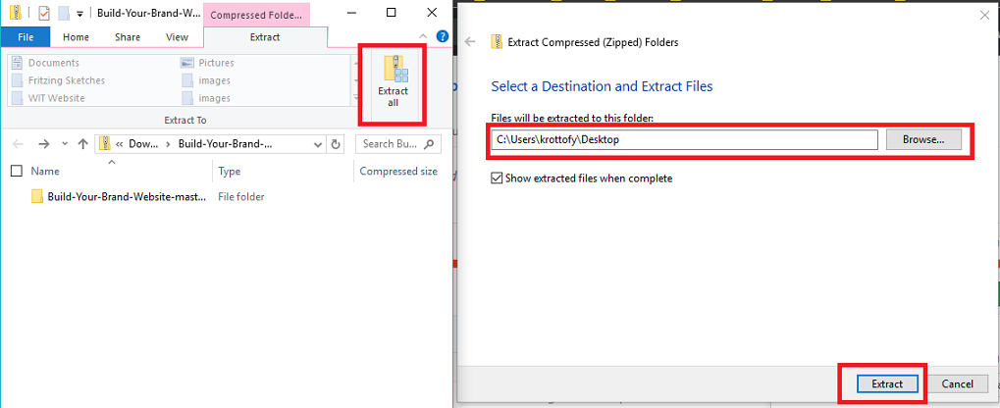
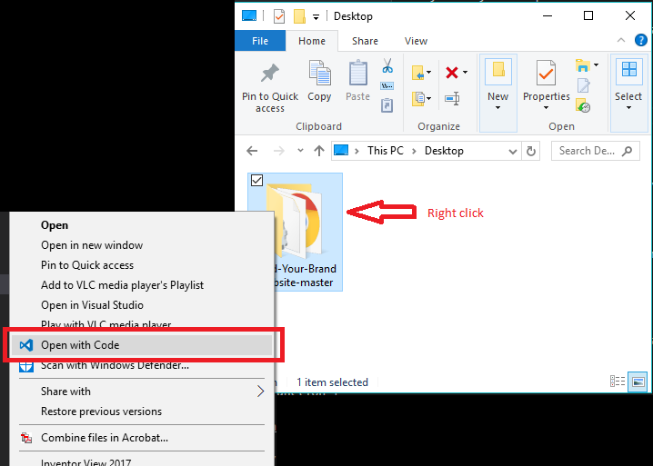
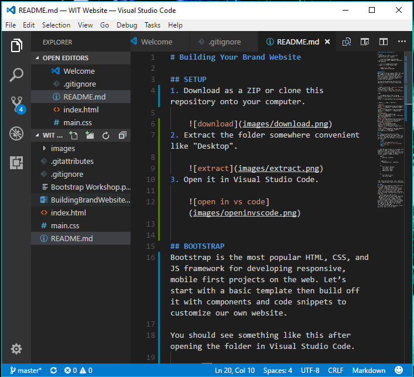
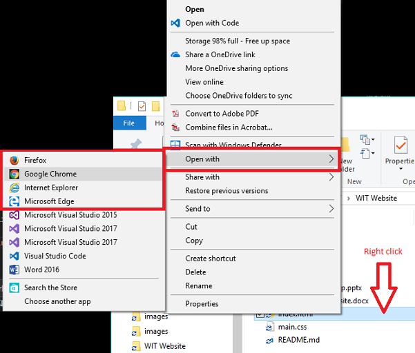
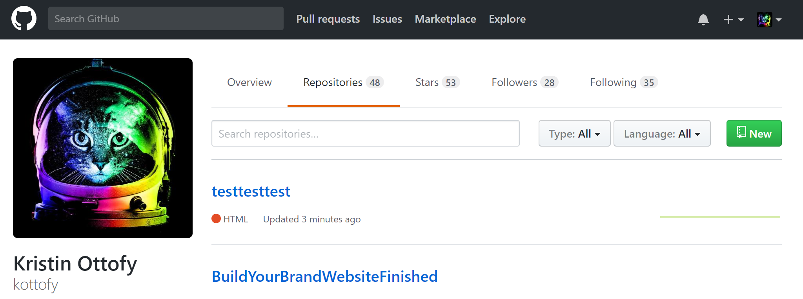
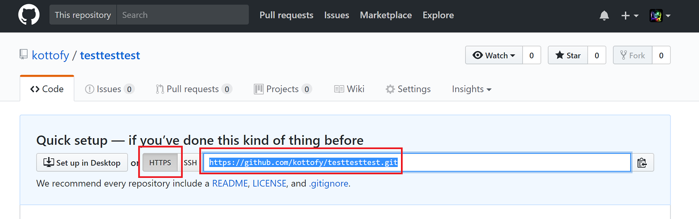
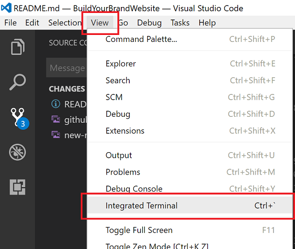
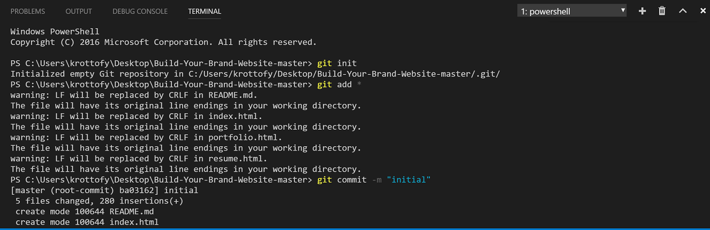
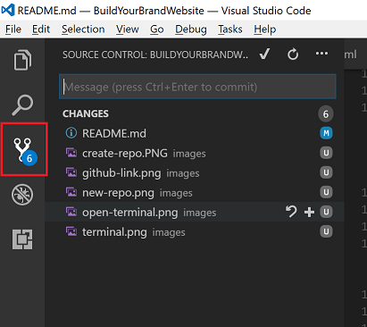

# Building Your Brand 

- PowerPoint [http://aka.ms/buildyourbrandwebsiteppt
](http://aka.ms/buildyourbrandwebsiteppt)
- Demo of starter template: [http://buildyourbrandwebsite.azurewebsites.net](http://buildyourbrandwebsite.azurewebsites.net)
- Demo of finished page: [http://buildyourbrandwebsitefinished.azurewebsites.net](http://buildyourbrandwebsitefinished.azurewebsites.net)


## INSTALL
Please install or check that these programs are running on your computer (Windows, Linux, Mac).
- [Visual Studio Code](https://code.visualstudio.com/) 
- [Git](https://git-scm.com/book/en/v2/Getting-Started-Installing-Git)
    - Optionally, you can install [GitHub Desktop](https://desktop.github.com/) which is a nice user interface for GitHub.
    - To check if Git is running on your computer, open Terminal/Powershell and run the command `git --version`.

## PUBLISH
To host your website in the cloud, you will need to make two new accounts:
- GitHub 
  - Sign up at https://github.com 
- Microsoft Account
  - Azure requires a Microsoft or work/school email account (@edu, @outlook, @hotmail, etc). If you don’t have one, create one at https://signup.live.com or trying logging in a http://login.live.com
- Azure options:
  - (Option 1) If you have a .edu account, you can activate Azure for free at http://imagine.microsoft.com
  - (Option 2) If using an Azure Pass provided by Microsoft, please visit [http://microsoftazurepass.com](http://microsoftazurepass.com)
  - (Option 3) Otherwise, sign up at https://microsoft.azure.com for a Free Trial.


## SETUP
1. Download as a ZIP or clone this repository onto your computer. 
    
    
2. Extract the folder somewhere convenient like "Desktop".

    
3. Open it in Visual Studio Code.
    
    

You should see something like this after opening the folder in Visual Studio Code.
    

4. Right-click on the `resume.html` file and select "Reveal in Explorer". 

    
5. Double-click or open the `resume.html` file in a browser to view the current site.

    

## BOOTSTRAP
Bootstrap is the most popular HTML, CSS, and JS framework for developing responsive, mobile first projects on the web. Let’s start with a basic template then build off it with components and code snippets to customize our own website.

1. Copy and paste the code below under where it says `<!-- Navbar code goes here -->` to add a Navbar/menu to the `index.html`, `portfolio.html`, and `resume.html` pages
    ```html
    <!-- Navbar code goes here -->
    <nav class="navbar navbar-expand-lg navbar-light bg-light">
        <button class="navbar-toggler" type="button" data-toggle="collapse" data-target="#navbarNav" aria-controls="navbarNav" aria-expanded="false" aria-label="Toggle navigation">
          <span class="navbar-toggler-icon"></span>
        </button>
        <div class="collapse navbar-collapse" id="navbarNav">
          <ul class="navbar-nav">
            <li class="nav-item">
              <a class="nav-link" href="index.html">About</a>
            </li>
            <li class="nav-item">
              <a class="nav-link" href="resume.html">Resume</a>
            </li>
            <li class="nav-item">
              <a class="nav-link" href="portfolio.html">Portfolio</a>
            </li>
          </ul>
        </div>
      </nav>
      ```

      
2. Open a new tab in your browser and navigate to the [Bootstrap examples website](https://v4-alpha.getbootstrap.com/examples/).

3.	Try adding some of the following elements to your website from the table below.

| Feature  |  Type |  Function |
|---|---|---|
|  [Jumbotron](https://v4-alpha.getbootstrap.com/examples/jumbotron/) | Component  |  Showcase key content |
|  [Typography](https://v4-alpha.getbootstrap.com/content/typography/) | CSS  | Different ways of displaying text  |
|[Grid System](https://v4-alpha.getbootstrap.com/layout/grid/) |  CSS |  Utilize 12-column system of Bootstrap to divide up your content |
|  [Responsive Helpers](https://v4-alpha.getbootstrap.com/utilities/responsive-helpers/) | Component  |  For documents, videos, etc. |
|  [ScrollSpy](https://v4-alpha.getbootstrap.com/components/scrollspy/) |  JavaScript | Enables functionality for the Navbar  |

## CSS
1.	In Visual Studio Code, open the file `main.css`. 
	This is being referenced in the `resume.html` file by the line: 

    `<link href="main.css" rel="stylesheet" type="text/css">`


3.	Add CSS code to `main.css` to assign style elements to tags or containers in your html files. Don’t forget to use a class selector (.containername) to apply style to classes. Example (.jumbotron) below:
    ```css
    body {     
        position: relative;
    } 

    .jumbotron {
        background-color: lightblue; 
    }

    h1 {    
        font-family: Georgia;
        text-align: center;     
        font-style: italic;
        padding-top: 50px; 
    } 
    
    p {     
        font-family: Arial;     
        font-size: 20px;     
    } 
    ```

**For help with CSS syntax rules, check out https://www.w3schools.com/css/css_syntax.asp 

## GITHUB

1.	Navigate to your [GitHub](http://github.com) page and create new repository with a name of your choice in GitHub. Note the link that is associated with your repo. 

    
    
    


2. Jump to VS Code and open the Terminal by opening the View menu and selecting `Integrated Terminal`.

    

3. Copy, paste, and run the following code lines to commit all files to your repo and upload them. Note: you can delete the template image folder and the `README.md` file as you won't need those for your website.
    1. `git init`
    2. `git add *`
    3. `git commit -m "initial"`
    4. Update to your link first! `git remote add origin https://github.com/kottofy/testtesttest.git`
    5. `git push -u origin master`

    

You can now use the Visual Studio Source Control interface rather than the Terminal!
    


## AZURE
3.	Login to Azure, then create new Web App.

    

4.	Point this to your GitHub repo and voila, you’re in the cloud!

    


